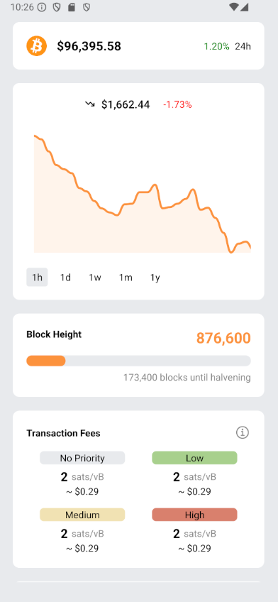

# ₿ Bitcoin Terminal

A simple bitcoin terminal built in React-Native.

## Features 
 - Current Price
 - Historical Price
 - Block Height
 - Transaction Fees
 - Multiple Currency Support (USD, EUR, GBP, JPY) 



## Running the app
 - Clone the repository `git clone git@github.com:kylemccullen/bitcoin-terminal.git`
 - Enter the directory `cd bitcoin-terminal`
 - Install dependencies `npm install`
 - Add a `secrets.ts` file at the root of the project
```ts
export const API_URL = 'https://rest.coinapi.io/v1/exchangerate';
export const API_KEY = '<YOUR-API-KEY-HERE>';
```
 - Run the app `npx expo start`
 - See expo docs for more details https://docs.expo.dev/
